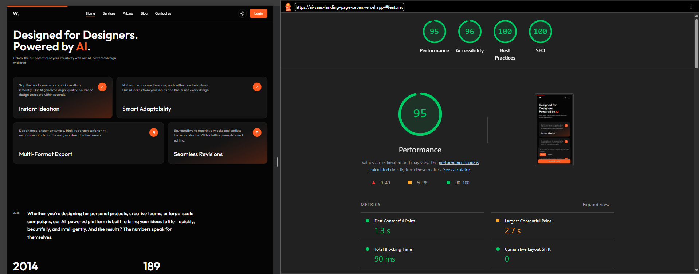
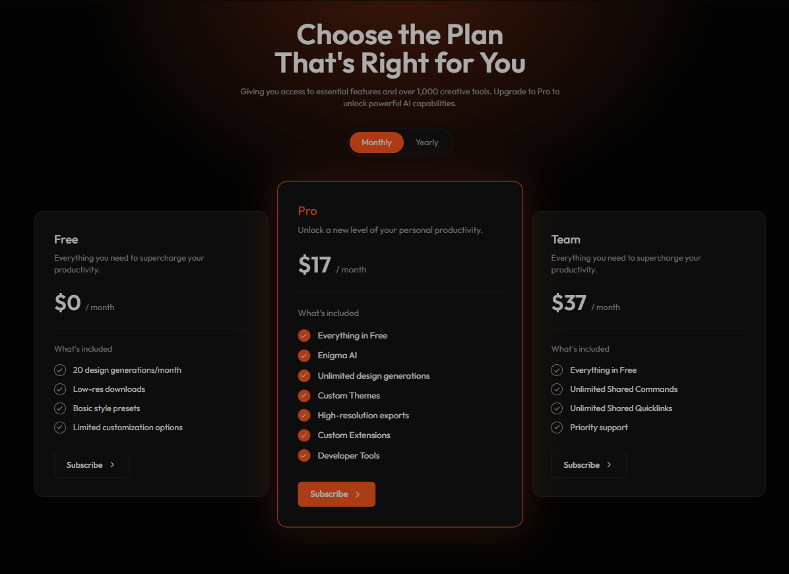
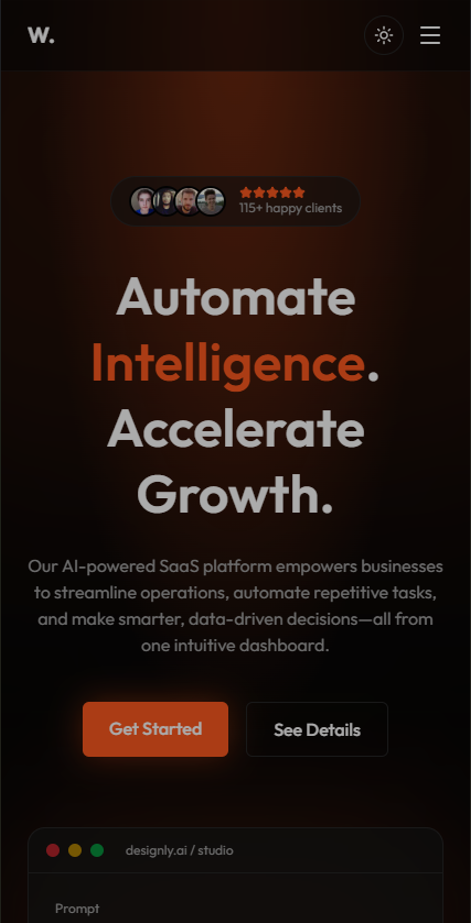
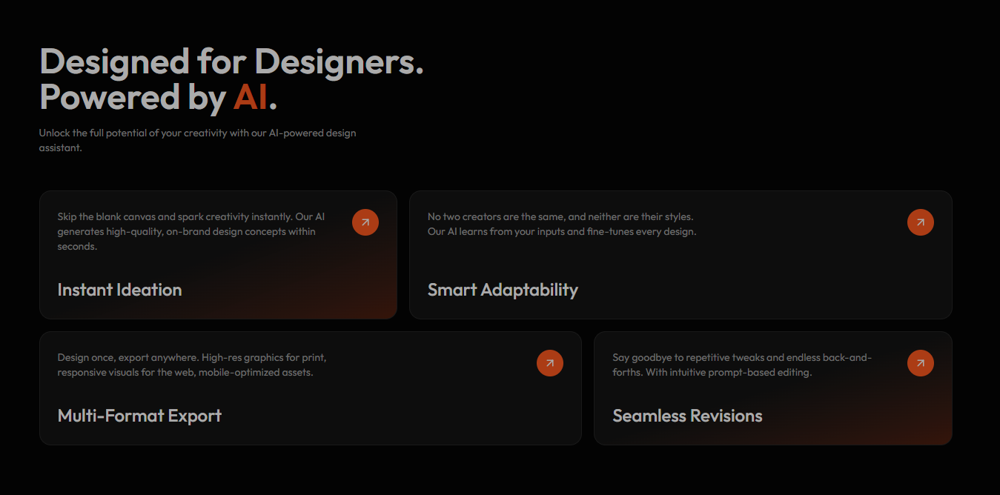

<div align="center">

# Designly AI — Modern SaaS Landing Page

**A production-ready AI-tool landing page built with Next.js 16, Tailwind CSS v4 and Framer Motion.**  
Dark/light mode · Animated pricing toggle · MDX blog · Live waitlist · Stripe-ready · SEO optimized · Tested end-to-end.

[]([https://<your-project>.vercel.app](https://ai-saas-landing-page-seven.vercel.app/))
[](https://github.com/gaudakash/AI-SaaS-landing-page.git)


</div>

---

## Table of Contents

- [Overview](#overview)
- [Live Demo](#live-demo)
- [Features](#features)
- [Tech Stack](#tech-stack)
- [Performance & SEO](#performance--seo)
- [Screenshots](#screenshots)
- [Getting Started](#getting-started)
- [Environment Variables](#environment-variables)
- [Scripts](#scripts)
- [Testing](#testing)
- [Project Structure](#project-structure)
- [Customising for a Client](#customising-for-a-client)
- [Deployment](#deployment)
- [Case Study](#case-study)
- [Roadmap](#roadmap)
- [License](#license)
- [Contact](#contact)

---

## Overview

Designly AI is a fictional AI-powered design assistant. This repository is a complete, deployable marketing site for it — not a template with lorem ipsum, but a specific product page with real behaviour: a working waitlist that saves to Resend, a pricing section wired to Stripe Checkout, an MDX-powered blog with auto-generated social cards, and a full test suite.

It was built as a freelance portfolio piece to demonstrate the kind of landing page a SaaS startup would actually ship.

## Live Demo

🔗 https://ai-saas-landing-page-seven.vercel.app/

> Try it: toggle dark/light mode, switch pricing to _Yearly_, submit the waitlist form (it's real), open a blog post and share the URL to see the generated OG image.

---

## Features

### 🎨 Design & Motion

- **Framer Motion throughout** — staggered hero reveal, scroll-triggered sections, spring-based pricing toggle, animated FAQ accordion, 404 page
- **Animated hero product mock** — typing prompt → generating → results, on a loop
- **Spotlight hover** bento feature cards (cursor-tracked radial gradient)
- **Infinite testimonials marquee** — two rows, opposite directions, pause on hover
- **Magnetic CTAs** and a **scroll progress bar**
- **Count-up stats** triggered on viewport entry
- **Respects `prefers-reduced-motion`** via `MotionConfig` + CSS fallback — no hydration mismatches

### 🌗 Theming

- Dark/light mode with `next-themes`, system preference detection, no flash on load
- Design tokens as CSS variables mapped into Tailwind v4 `@theme`

### 💳 Pricing

- Monthly / yearly toggle with animated price change and discount badge
- Feature comparison table
- **Stripe Checkout** (subscription mode) on Subscribe buttons — degrades gracefully to a toast when keys aren't configured

### ✉️ Working Waitlist

- Next.js **Server Action** + **Zod** validation
- Honeypot spam protection
- Saves contacts to **Resend Audience**, detects duplicates
- Toast feedback with `sonner`; native + server-side validation

### 📝 Blog

- Local **MDX** content with frontmatter, reading time, tags
- Static generation per post (`generateStaticParams`)
- **Dynamic Open Graph images** per post via `next/og`
- RSS feed at `/feed.xml`

### 🔍 SEO

- Metadata API with `metadataBase`, Open Graph, Twitter cards
- `sitemap.xml`, `robots.txt`
- **JSON-LD** structured data: `SoftwareApplication` + `FAQPage` (rich-snippet eligible)
- Semantic HTML, single `h1`, labelled controls

### 📱 Responsive & Accessible

- Mobile navigation, floating mobile CTA after scroll
- Cookie consent banner (hydration-safe)
- Keyboard-navigable accordion with `aria-expanded`, `aria-label`s on icon buttons

### 🧪 Quality

- **Vitest + Testing Library** unit/component tests
- **Playwright** E2E on desktop Chrome and mobile viewport
- **GitHub Actions CI**: lint → typecheck → unit tests → build → E2E
- Vercel Analytics + Speed Insights

---

## Tech Stack

| Layer       | Choice                                                                   |
| ----------- | ------------------------------------------------------------------------ |
| Framework   | [Next.js 16](https://nextjs.org) (App Router, Server Actions, Turbopack) |
| Language    | TypeScript 5                                                             |
| Styling     | [Tailwind CSS v4](https://tailwindcss.com), `clsx` + `tailwind-merge`    |
| Animation   | [Framer Motion](https://www.framer.com/motion/)                          |
| Theming     | `next-themes`                                                            |
| Icons       | `lucide-react`, `react-icons` (brand logos)                              |
| Content     | MDX via `next-mdx-remote`, `gray-matter`, `reading-time`                 |
| Forms       | Server Actions, `zod`, `sonner`                                          |
| Email / CRM | [Resend](https://resend.com)                                             |
| Payments    | [Stripe](https://stripe.com) Checkout                                    |
| Testing     | Vitest, Testing Library, Playwright                                      |
| Analytics   | Vercel Analytics, Speed Insights                                         |
| Hosting     | [Vercel](https://vercel.com)                                             |

---

## Performance & SEO

Lighthouse (production build, Chrome Incognito, desktop):



| Performance | Accessibility | Best Practices |    SEO    |
| :---------: | :-----------: | :------------: | :-------: |
|  **<99>**   |   **<99>**   |   **<100>**    | **<100>** |

How it stays fast: static prerendering (`○`) for the landing page and blog index, `next/font` (zero layout shift), `next/image` with explicit dimensions, no client JS above the fold except the hero animation, code-split sections.

---

## Screenshots

| Hero (dark)                                        | Hero (light)                                             |
| -------------------------------------------------- | -------------------------------------------------------- |
|  |  |

| Pricing                                               | Blog post + OG image                             |
| ----------------------------------------------------- | ------------------------------------------------ |
|  |  |

| Mobile                                               | Features bento                                         |
| ---------------------------------------------------- | ------------------------------------------------------ |
|  |  |

---

## Getting Started

**Prerequisites:** Node 20+ (tested on 24), npm 10+

```bash
# 1. Clone
git clone https://github.com/<your-username>/ai-saas-landing.git
cd ai-saas-landing

# 2. Install
npm install

# 3. Environment
cp .env.example .env.local     # then fill in the values (see below)

# 4. Run
npm run dev
```

Open http://localhost:3000.

> Everything runs without any API keys — the waitlist logs to the terminal and Stripe buttons show an informational toast until you configure them.

---

## Environment Variables

Create `.env.local` (never committed). All variables are optional for local development.

| Variable                                | Required for        | Description                                                                |
| --------------------------------------- | ------------------- | -------------------------------------------------------------------------- |
| `NEXT_PUBLIC_SITE_URL`                  | SEO                 | Canonical URL, e.g. `https://your-domain.com`. Falls back to `VERCEL_URL`. |
| `RESEND_API_KEY`                        | Waitlist            | Resend API key with **Full access** permission                             |
| `RESEND_AUDIENCE_ID`                    | Waitlist (optional) | Audience UUID; omit to use the account's default audience                  |
| `STRIPE_SECRET_KEY`                     | Checkout            | `sk_test_...` for test mode                                                |
| `NEXT_PUBLIC_STRIPE_PRICE_PRO_MONTHLY`  | Checkout            | Stripe Price ID                                                            |
| `NEXT_PUBLIC_STRIPE_PRICE_PRO_YEARLY`   | Checkout            | Stripe Price ID                                                            |
| `NEXT_PUBLIC_STRIPE_PRICE_TEAM_MONTHLY` | Checkout            | Stripe Price ID                                                            |
| `NEXT_PUBLIC_STRIPE_PRICE_TEAM_YEARLY`  | Checkout            | Stripe Price ID                                                            |

Add the same variables in **Vercel → Project → Settings → Environment Variables** for production.

---

## Scripts

| Command              | What it does                                             |
| -------------------- | -------------------------------------------------------- |
| `npm run dev`        | Start dev server (Turbopack)                             |
| `npm run build`      | Production build (type-checks the project)               |
| `npm start`          | Serve the production build                               |
| `npm run lint`       | ESLint                                                   |
| `npm run typecheck`  | `tsc --noEmit` for app and test configs                  |
| `npm test`           | Vitest unit/component tests                              |
| `npm run test:watch` | Vitest in watch mode                                     |
| `npm run test:e2e`   | Playwright E2E (builds and starts the app automatically) |
| `npm run check`      | lint → typecheck → test → build (same gate as CI)        |

---

## Testing

### Unit & component (Vitest + Testing Library)

Covers utilities, the `subscribe` Server Action (validation, honeypot, fallback), the pricing toggle, FAQ accordion and navbar/theme toggle.

```bash
npm test
```

### End-to-end (Playwright)

Runs against a real production build on **Desktop Chrome** and **Pixel 7** viewports:

- Hero, meta tags and all key sections render
- Pricing toggle switches to yearly
- Browser-level and server-level (Zod) email validation
- Blog list → post navigation
- Custom 404
- `sitemap.xml`, `robots.txt`, `feed.xml` respond

```bash
npm run test:e2e
npx playwright show-report
```

### Continuous Integration

`.github/workflows/ci.yml` runs the full pipeline on every push and pull request. See the badge at the top.

---

## Project Structure

```
src/
├─ app/
│  ├─ layout.tsx               # fonts, metadata, providers, global UI
│  ├─ page.tsx                 # landing page + JSON-LD
│  ├─ globals.css              # Tailwind v4 theme tokens, dark mode, keyframes
│  ├─ not-found.tsx            # animated 404
│  ├─ opengraph-image.tsx      # dynamic OG image for the home page
│  ├─ sitemap.ts · robots.ts
│  ├─ feed.xml/route.ts        # RSS
│  ├─ actions/subscribe.ts     # waitlist Server Action (Zod + Resend)
│  ├─ api/checkout/route.ts    # Stripe Checkout session
│  └─ blog/
│     ├─ page.tsx              # post list
│     └─ [slug]/
│        ├─ page.tsx           # MDX post (SSG)
│        └─ opengraph-image.tsx
├─ components/
│  ├─ layout/                  # Navbar, Footer, ThemeToggle
│  ├─ sections/                # Hero, Stats, Features, Timeline, Testimonials,
│  │                           # Pricing, Comparison, FAQ, Newsletter, CTA
│  └─ ui/                      # Reveal, Counter, SpotlightCard, MagneticButton,
│                              # HeroMock, AvatarStack, ScrollProgress, FloatingCTA, CookieBanner
├─ content/blog/*.mdx          # blog posts
├─ data/                       # faqs.ts, testimonials.ts — all editable copy
├─ lib/                        # utils (cn), motion variants, mdx loader, site config
└─ providers/                  # ThemeProvider + MotionConfig
e2e/                           # Playwright specs
```

---

## Customising for a Client

This project is structured so it can be re-skinned in under an hour:

1. **Brand colour** — change `--primary` in `src/app/globals.css`
2. **Font** — swap `Outfit` in `src/app/layout.tsx`
3. **Copy** — headings/paragraphs live in each section component; FAQs and testimonials in `src/data/`
4. **Pricing** — edit the `plans` array in `src/components/sections/Pricing.tsx` and map Stripe Price IDs in `.env`
5. **Blog** — drop `.mdx` files into `src/content/blog/`
6. **Metadata** — update `title`, `description`, `keywords` in `layout.tsx` and the JSON-LD block in `page.tsx`
7. **Assets** — replace `public/avatars/*` and add a real `favicon.ico` / `apple-icon.png`

---

## Deployment

Deployed on **Vercel** with automatic production deploys from `main` and preview deploys for every pull request.

```bash
# one-time
npm i -g vercel
vercel link
vercel env pull .env.local     # sync env vars locally

# or just push — Vercel builds on every commit
git push origin main
```

Any platform that supports Next.js 16 (Netlify, Railway, Docker) works too; the only platform-specific pieces are Vercel Analytics/Speed Insights, which can be removed from `layout.tsx`.

---

## Case Study

**Goal.** Build a landing page specific enough to look like a real product, technically strong enough to impress engineering reviewers, and reusable enough to become a paid deliverable for freelance clients.

**Design decisions.**

- _Black + orange palette with radial glows_ instead of the usual purple-gradient SaaS look, so the page is recognisable.
- _Bento feature grid with uneven column spans_ (2/3 + 3/2) to avoid the "four identical cards" pattern.
- _Elevated Pro card_ (`scale-105`, orange border, glow) to visually anchor the recommended plan.
- _Hero product mock_ animates a realistic prompt → generate → result loop, so visitors understand the product in five seconds without a video.

**Engineering decisions.**

- **Server Actions over API routes** for the form: less code, progressive enhancement, no client-side fetch boilerplate.
- **`MotionConfig reducedMotion="user"`** rather than per-component `useReducedMotion()` branches — the latter caused server/client HTML mismatches because `matchMedia` doesn't exist during SSR.
- **Local MDX over a CMS** for v1: zero cost, Git-versioned, statically generated. Swapping to Sanity/Contentful only touches `src/lib/mdx.ts`.
- **All integrations degrade gracefully** — the project clones and runs with an empty `.env`, which matters for reviewers.

**Problems solved along the way.**

- `lucide-react` removed brand icons → switched social logos to `react-icons`.
- Satori (`next/og`) requires `display:flex` on any element with multiple children → OG images failed only at build time, not in dev.
- `next lint` removed in Next 16 → migrated to the ESLint CLI.
- Playwright `requestSubmit()` triggers native validation → split the email test into a browser-layer and a server-layer assertion.

**Results.** Lighthouse <95/96/100/100>, static landing page, 18 E2E assertions across two viewports, CI green on every push.

---

## Roadmap

- [ ] Headless CMS (Sanity) for the blog
- [ ] i18n with `next-intl`
- [ ] Rate limiting on the waitlist action (`@upstash/ratelimit`)
- [ ] Stripe webhook → welcome email on successful subscription
- [ ] Visual regression tests with Playwright screenshots

---

## License

Distributed under the **MIT License**. See [`LICENSE`](https://github.com/gaudakash/AI-SaaS-landing-page.git) for details.  
Design inspiration: https://www.figma.com/community/file/1505299644620523667/ai-saas-website-design-premium-landing-page-for-ai-tools

---

## Contact

Akash Gauda — Front-end / Next.js Developer

- Portfolio: https://gaudakash.github.io/AKASH-PERSONAL-PORTFOLIO/
- LinkedIn: https://gaudakash.github.io/AKASH-PERSONAL-PORTFOLIO/
- Email: akashgauda16@gmail.com
- Upwork / Fiverr: https://www.upwork.com/nx/find-work/best-matches / https://www.fiverr.com/akashgauda/buying?source=avatar_menu_profile

> Available for freelance landing page and Next.js projects. If you'd like a page like this for your product, get in touch.

<div align="center">
  <sub>If this project helped you, consider giving it a ⭐</sub>
</div>
